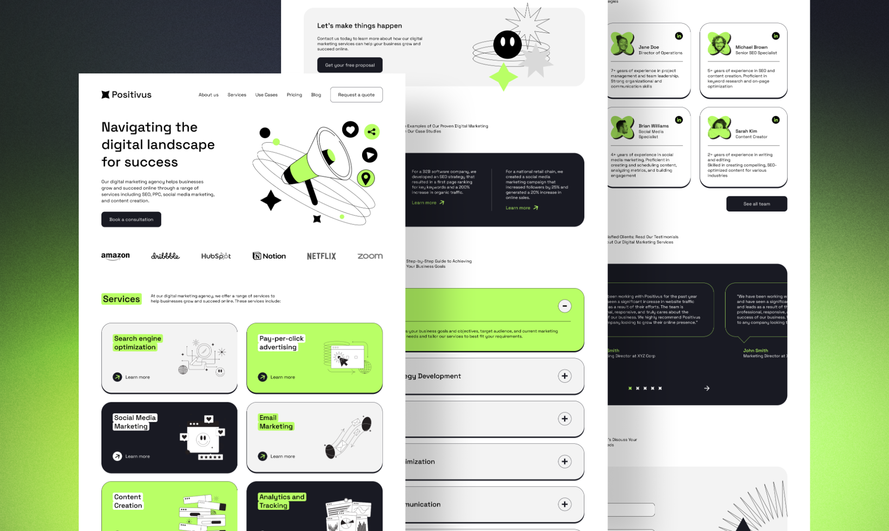

# 📈 Positivus

Яркий, современный и отзывчивый лендинг для прогрессивного digital-агентства. Проект демонстрирует переход от чистого CSS к автоматизированной профессиональной разработке: с использованием препроцессора Sass, строгой методологии БЭМ и оптимизации сборки через кастомные npm-скрипты.

## 🛠 Мой Стек и Инструменты

### 🏗 Архитектура, Сборка и Автоматизация
* **Sass (SCSS) + БЭМ** — продвинутая модульная структура стилей. Логика разделена на независимые компоненты, переменные и миксины, а методология БЭМ полностью исключает каскадные конфликты.
* **npm Scripts Automation** — управление процессами разработки без тяжелых сборщиков (Webpack/Vite):
  * `npm run watch` — автоматическое отслеживание изменений в SCSS-файлах и мгновенная компиляция «на лету».
  * `npm run build` — финальная сборка проекта с минификацией CSS-кода для максимальной скорости загрузки у пользователя.
* **HTML5 Semantics** — чистая, валидная и доступная разметка (использование тегов `<header>`, `<main>`, `<section>`, `<article>`), оптимизированная для поисковых роботов (SEO basics).

### 🎨 Стили, Адаптив и Модульность
* **Sass (SCSS) + БЭМ** — продвинутая модульная структура стилей. Логика разделена на независимые БЭМ-компоненты, переменные и миксины, а методология БЭМ полностью исключает каскадные конфликты.
* **Адаптивность через SCSS-миксины (Mixins-Driven Responsive)** — вместо громоздких и разрозненных `@media`-запросов используются кастомные семантичные миксины (`@include desktop`, `@include tablet`, `@include mobile`). Они внедряются прямо внутрь БЭМ-селекторов, изолируя адаптивную логику конкретного элемента в одном месте.

### 📐 Дизайн, UX и Доступность (a11y)
* **Проработанный UI/UX** — интерактивные элементы (`hover`, `active`, `focus`) имеют плавные анимации и четкие состояния, улучшая поведенческие факторы пользователей.
* **Доступность (a11y)** — поддержка доступности для скринридеров с помощью утилитарного скрытия элементов (`.visually-hidden`) и нативной семантики.
* **Performance Optimization** — оптимизация графики, ленивая загрузка (`loading="lazy"`) и минимизированные стили обеспечивают мгновенный рендеринг страницы.

## 🪵 Инженерная культура и Git
Проект ведется по лучшим практикам командной разработки:
* **Атомарные коммиты** — понятная история изменений, проект не заливается «одним куском», а коммитится пошагово по мере реализации фич.
* **Следование стандартам** — аккуратное оформление кода, соблюдение вложенности и структуры папок.
